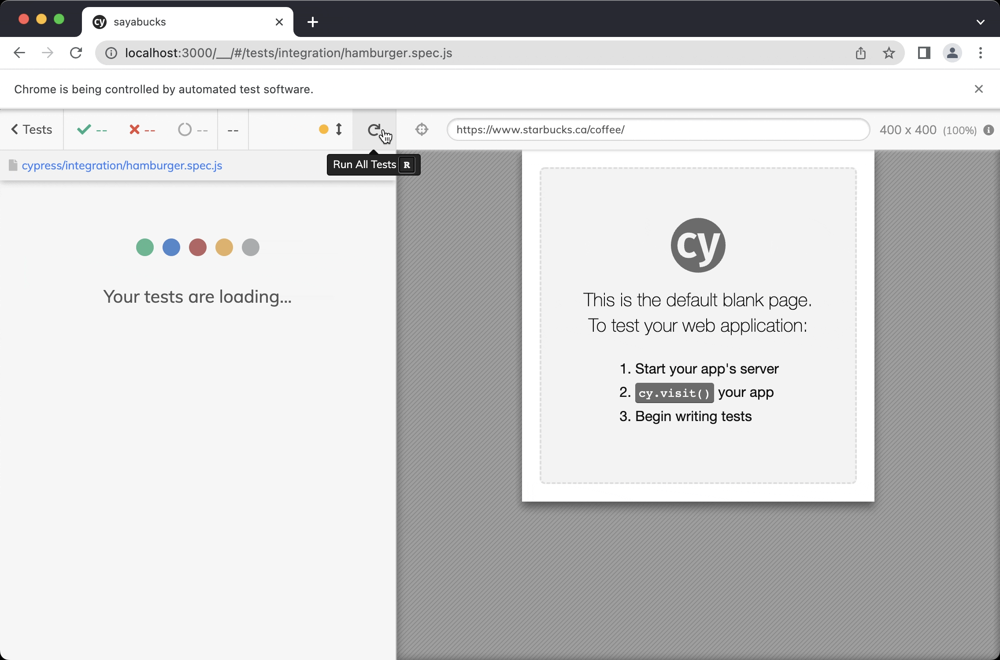

# Vite-React-Ts


This website is a clone landing page of Starbucks.

This is a barebone project template for [React](https://reactjs.org/) apps using [Vite](https://vitejs.dev/) as a build tool and the [airbnb configuration for eslint](https://www.npmjs.com/package/eslint-config-airbnb) as well as [prettier](https://prettier.io/) for code formatting and [husky](https://github.com/typicode/husky) to setup git hooks. It comes with a basic github workflow that runs eslint and checks the formatting of the code.

## Extensions

- [ES7 React/Redux/GraphQL/React-Native snippets](https://marketplace.visualstudio.com/items?itemName=dsznajder.es7-react-js-snippets)
- [Prettier - Code formatter](https://marketplace.visualstudio.com/items?itemName=esbenp.prettier-vscode)
- [ESLint](https://marketplace.visualstudio.com/items?itemName=dbaeumer.vscode-eslint)

## Scripts

Run Linter

    npm run style:lint

Run Code Formatter Check

    npm run style:prettier

Run Code Formatting

    npm run fix

Run All Style Checks

    npm run style:all

You can find this template at https://github.com/bastiannispel/vite-react-ts

## Using React Context in the Hamburger Menu

I knew that I had to store the hamburger's open and closed state, so I created a component that uses React Context, in [this file](./src/Context/OpenContext.tsx):

```typescript
export const OpenContext = createContext<InitialState | null>(null);
```

Then, I created a provider to share the open/close state with children components in [the main app component](./src/App/App.tsx):

```typescript
export default function App() {
  return (
    <div className={styles.app}>
      <OpenProvider>
        <Header />
        <Page />
      </OpenProvider>
      <Footer />
    </div>
  );
}
```

## Cypress Tests

This was my first time using Cypress but I found it very intuitive and convenient for testing the UI.

[](https://asciinema.org/a/489175)

It was also very convenient to iterate on the test cases using the Cypress UI.


